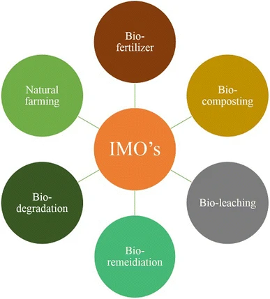

### Beneficial Indigenous Microorganisms: Nature's Soil Builders

Beneficial Indigenous Microorganisms (BIM) is a locally-sourced, fermented solution that harnesses the power of native soil microbes.
This living amendment contains a diverse community of bacteria, fungi, and other microorganisms that naturally exist in healthy soils.
When properly cultured, BIM becomes a powerful farming tool that forms complex relationships within the soil food web, where they perform essential functions such as[^1]:

1. **Breaking down organic matter**: Converting complex compounds into simpler forms that plants can use, recycling nutrients that would otherwise remain locked in dead plant material.
2. **Fixing atmospheric nitrogen**: Certain bacteria can convert nitrogen from the air into forms plants can utilize, reducing the need for synthetic nitrogen fertilizers.
3. **Solubilizing phosphates**: Making phosphorus more available to plants by converting bound phosphates into soluble forms.
4. **Producing plant growth hormones**: Synthesizing substances like indole-3-acetic acid (IAA) that stimulate plant growth and development.
5. **Competing with pathogens**: Creating an environment where harmful microorganisms struggle to establish themselves.
6. **Improving soil structure**: Producing compounds like glomalin (a glycoprotein produced by mycorrhizal fungi) that bind soil particles together, improving water retention and reducing erosion.
7. **Aiding in bioremediation**: Helping to break down pollutants and restore contaminated soils.[^3] [^4]

 [^6]

What makes BIM particularly valuable is that it's created using microorganisms already adapted to your local environment. These indigenous microbes perform critical functions in the soil ecosystem, including nutrient cycling, organic matter decomposition, and natural pest suppression. Throughout this tutorial, we'll explore how to culture your own BIM solution and apply it effectively across various farm applications—from soil preparation to crop protection.

### The Science Behind BIM

Research shows[^2] that indigenous microorganisms significantly enhance organic matter decomposition. These native microbes include beneficial bacteria, fungi, and actinomycetes that are already adapted to your local soil conditions. When properly cultured, these microbes rapidly break down organic materials, convert nutrients into plant-available forms, and compete with pathogenic organisms.

Studies demonstrate that compost inoculated with BIM shows increased microbial diversity throughout the decomposition process. During composting, different microbial communities dominate at various stages:
- Initial phase: Mesophilic bacteria and actinomycetes break down simple compounds
- Heating phase: Thermophilic bacteria process more complex materials
- Maturation phase: Actinomycetes complete the decomposition of resistant compounds

### Step-by-Step Guide to Culturing BIM

Creating your own BIM solution involves a four-stage process that selectively cultures beneficial microorganisms from your local environment.

#### Stage 1: Collecting Indigenous Microorganisms (BIM-1)

**Materials needed:**
- 2 cups of cooked white rice (no salt or oil)
- Shallow plastic container with lid
- Paper sheet
- Plastic wrap
- Shovel

**Instructions:**
1. Allow cooked rice to cool completely
2. Place rice in a shallow container, filling it about 1/3 full
3. Cover with paper and secure with plastic wrap (poke several small holes for air exchange)
4. Dig a 5-inch deep hole under healthy trees (bamboo, fruit trees, or forest edges work best)
5. Place container in the hole and cover with soil and dried leaves
6. Leave undisturbed for 5-7 days
7. Harvest when white mycelium (thread-like fungal growth) appears on the rice

*Success indicator: White, sweet-smelling mycelium covering the rice. If it smells foul or shows black/green growth, discard and try again in a different location.*

#### Stage 2: First Fermentation (BIM-2)

**Materials needed:**
- BIM-1 (collected rice with mycelium)
- Brown sugar or molasses (equal weight to BIM-1)
- Clean container with lid

**Instructions:**
1. Mix BIM-1 with equal parts brown sugar or molasses (1:1 ratio by weight)
2. Transfer to a clean container, filling no more than 3/4 full
3. Cover loosely to allow gases to escape
4. Store in a cool, dark place for 7 days
5. Stir once daily if possible

*Success indicator: Sweet, slightly alcoholic smell with bubbling fermentation activity.*

#### Stage 3: Multiplication Phase (BIM-3)

**Materials needed:**
- 10g of BIM-2
- 1 liter distilled or non-chlorinated water
- 8kg rice bran
- Large container
- Plastic covering
- Rice straw or dried leaves

**Instructions:**
1. Dissolve 10g of BIM-2 in 1 liter of water, mixing until liquid turns brownish
2. Pour this solution over 8kg of rice bran and mix thoroughly
3. Place mixture in a larger container and cover with plastic
4. Cover with a layer of rice straw or dried leaves for insulation
5. Leave in a shaded area for 5 days

*Success indicator: Sweet, earthy smell with visible white mycelium growth.*

#### Stage 4: Final Preparation (BIM-4)

**Materials needed:**
- BIM-3 mixture
- Equal amount of good garden soil
- Shovel for mixing

**Instructions:**
1. Mix BIM-3 with an equal amount of quality soil (1:1 ratio)
2. Form into a mound or fill containers
3. Cover lightly with straw
4. Allow to mature for 7 days

*Success indicator: Rich earthy smell and visible white mycelium.*

### Applications for Your Farm

#### 1. Supercharging Compost

BIM significantly enhances the composting process, as demonstrated by research. Here are two effective methods:

**Regular Compost Inoculation:**
1. Create layered compost pile with organic materials (maintaining C:N ratio of 25:1 to 30:1)
2. Add 1 cup of BIM-4 for every cubic foot of compost material
3. Mix BIM-4 with water (1:20 ratio) and spray between layers during pile construction
4. Turn compost every 5-7 days

**BIM-Accelerated Compost Method:**
Research shows optimum results when combining:
- 2.5kg rice straw (carbon source)
- 2.5kg animal manure (nitrogen source)
- 1.5kg rice bran (accelerator)
- BIM-4 solution (microbial inoculant)

This combination maintains ideal C:N ratios while providing diverse microbial communities to break down organic matter more efficiently.

#### 2. Soil Drench Application

Create a soil drench by diluting BIM-2 or BIM-4:
- For BIM-2: Dilute 1 part BIM-2 with 500-1000 parts water
- For BIM-4: Mix 1kg BIM-4 with 10 liters of water, strain, then dilute 1:10

Apply as a soil drench around plant roots every 2-4 weeks during growing season.

#### 3. Foliar Spray

For pest and disease resistance:
1. Dilute BIM-2 solution (1:1000 ratio with water)
2. Strain through fine cloth
3. Apply as foliar spray during early morning or late afternoon
4. Repeat every 7-14 days preventatively

### Expected Results and Benefits

Based on scientific research, you can expect several benefits from properly cultured BIM:

1. **Enhanced Nutrient Cycling:** Research shows BIM increases populations of microorganisms responsible for breaking down organic matter, making nutrients more available to plants.

2. **Improved Composting Efficiency:** Studies demonstrate BIM-treated compost has greater microbial diversity throughout the decomposition process.

3. **Disease Suppression:** Beneficial microorganisms compete with pathogens, reducing disease incidence naturally.

4. **Odor Reduction:** BIM promotes aerobic decomposition, reducing foul smells in compost and livestock areas.

5. **Soil Structure Improvement:** Microbial activity enhances soil aggregation, improving water infiltration and root penetration.

### Troubleshooting and Tips

- **Unpleasant Odors:** If your BIM smells foul rather than sweet/earthy, pathogenic organisms may have dominated. Discard and start over.

- **Optimal Temperature:** Maintain fermentation between 70-85°F (21-29°C) for best results.

- **Contamination Prevention:** Use clean tools and containers throughout the process.

- **Long-term Storage:** BIM-2 can be stored for up to 6 months in a cool, dark place. BIM-4 is best used within 1-2 months.

- **C:N Ratio:** While BIM enhances microbial activity, proper carbon-to-nitrogen ratios (25:1 to 30:1) remain essential for effective composting.

### Conclusion

Culturing your own Beneficial Indigenous Microorganisms provides a sustainable way to improve soil health using locally adapted microbes. By following this step-by-step process, you're harnessing the natural power of your farm's ecosystem to enhance plant growth, soil structure, and natural resilience.

Remember that BIM is just one component of a bio-intensive approach to soil health. For best results, combine BIM applications with other sustainable practices like cover cropping, mulching, and spouted seed teas.

### References

[^1]: ["Effective role of indigenous microorganisms for sustainable environment" (2015)](https://link.springer.com/article/10.1007/s13205-015-0293-6)
[^2]: ["Indigenous microorganisms production and the effect on composting process" (2013)](https://pubs.aip.org/aip/acp/article/1571/1/283/879581/Indigenous-microorganisms-production-and-the)
[^3]: ["Aerobic biodegradation process of petroleum and pathway of main compounds in water flooding well of Dagang oil field" (2013)](https://www.sciencedirect.com/science/article/abs/pii/S0960852413010018?via%3Dihub)
[^4]: ["Role of Indigenous Arsenate and Iron(III) Respiring Microorganisms in Controlling the Mobilization of Arsenic in a Contaminated Soil Sample" (2015)](https://link.springer.com/article/10.1007/s00128-015-1458-z)
[^5]: ["Plant growth promoting rhizobacteria as biofertilizers" (2003)](https://link.springer.com/article/10.1023/A:1026037216893)
[^6]: This figure comes from ["Effective role of indigenous microorganisms for sustainable environment"](https://link.springer.com/article/10.1007/s13205-015-0293-6)
